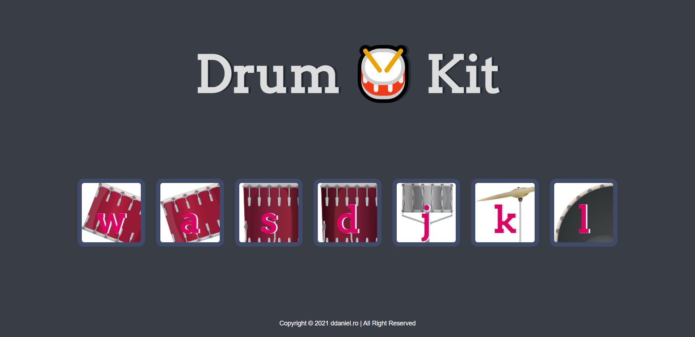

# 🥁 Drum Kit
# HTML/CSS/JS & DOM - Drum Kit

- [About this project](#about)
- [Features](#features)
- [Requirements](#requirements)
- [Technical Information](#technical_information)

## About
A digital drumkit that allows the user to play drum sounds when pressing down on corresponding key.
HTML, CSS, and Javascript

## Features
- [x] HTML
- [x] CSS
- [x] Javascript

## Requirements
- HTML
- CSS
- Javascript

## Deployment

To run the site on your local machine

1. Download or clone the repository onto your machine.
2. Extract the .zip file.
3. Open .html file in your browser.
5. Alternatively you can click on the following [Site Link](http://www.drum.ddaniel.ro/. "Site Link") to view
Demo: http://www.drum.ddaniel.ro/

## Authors

  * **Andrei Daniel**
    [ddaniel90](https://github.com/ddaniel90/Drum-Kit)

## License

This project is licensed under the MIT License.

Copyright (c) 2021 Andrei Daniel

Permission is hereby granted, free of charge, to any person obtaining a copy
of this software and associated documentation files (the "Software"), to deal
in the Software without restriction, including without limitation the rights
to use, copy, modify, merge, publish, distribute, sublicense, and/or sell
copies of the Software, and to permit persons to whom the Software is
furnished to do so, subject to the following conditions:

The above copyright notice and this permission notice shall be included in all
copies or substantial portions of the Software.

THE SOFTWARE IS PROVIDED "AS IS", WITHOUT WARRANTY OF ANY KIND, EXPRESS OR
IMPLIED, INCLUDING BUT NOT LIMITED TO THE WARRANTIES OF MERCHANTABILITY,
FITNESS FOR A PARTICULAR PURPOSE AND NONINFRINGEMENT. IN NO EVENT SHALL THE
AUTHORS OR COPYRIGHT HOLDERS BE LIABLE FOR ANY CLAIM, DAMAGES OR OTHER
LIABILITY, WHETHER IN AN ACTION OF CONTRACT, TORT OR OTHERWISE, ARISING FROM,
OUT OF OR IN CONNECTION WITH THE SOFTWARE OR THE USE OR OTHER DEALINGS IN THE
SOFTWARE.

## Acknowledgments

  - The Complete 2020 Web Development Bootcamp by Angela Yu